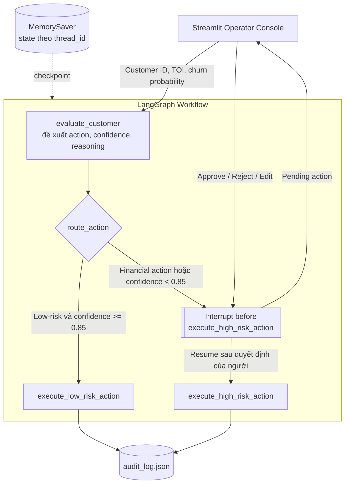

# ChurnGuard — Agent giữ chân khách hàng có Human-in-the-Loop

Một khách hàng có dấu hiệu sắp rời bỏ ngân hàng. Hệ thống nên gửi email chăm
sóc ngay, đề xuất tăng hạn mức tín dụng, hay chưa nên làm gì?

Nếu mọi trường hợp đều chờ nhân viên duyệt, đội vận hành sẽ nhanh chóng quá tải.
Nhưng nếu giao toàn quyền cho AI, một dự đoán sai có thể biến thành quyết định
tài chính thật. ChurnGuard giải quyết điểm cân bằng đó: **tự động hóa những hành
động ít rủi ro khi bằng chứng đủ chắc chắn, đồng thời buộc con người kiểm soát
mọi quyết định nhạy cảm hoặc chưa đủ tin cậy**.

Đây là bài Lab 27 về LangGraph Human-in-the-Loop. Agent trong phiên bản này là
một mô hình quyết định deterministic để bài lab chạy được mà không cần API key.
Các node execution cũng mô phỏng kết quả bằng state, chưa gọi hệ thống email hay
core banking thật.

## Bài toán được giải quyết

Đầu vào của một lượt đánh giá gồm:

- `customer_id`: khách hàng cần đánh giá;
- `total_operating_income`: tổng thu nhập hoạt động (TOI);
- `churn_probability`: xác suất khách hàng rời bỏ.

Từ dữ liệu đó, agent tạo ra ba thông tin mà người vận hành có thể hiểu và kiểm
tra: hành động đề xuất, confidence score và lý do đưa ra đề xuất.

Ví dụ với khách hàng có TOI `80.000.000 VND` và churn probability `0.90`, agent
đề xuất `increase_credit_limit` với confidence khoảng `0.96`. Confidence rất cao
nhưng đây vẫn là hành động tài chính. Hệ thống không cho phép agent tự thực hiện;
workflow phải dừng lại để một operator Approve, Reject hoặc Edit.

Ngược lại, một email chăm sóc là hành động ít rủi ro. Nếu confidence đạt ít nhất
`0.85`, email có thể được tự động thực thi. Nếu confidence thấp hơn ngưỡng, cùng
một email vẫn phải chuyển sang human review vì agent chưa đủ chắc chắn.

## Kiến trúc hệ thống



Kiến trúc được chia thành bốn vai trò rõ ràng:

1. **Streamlit là bàn làm việc của operator.** UI nhận dữ liệu khách hàng, hiển
   thị Action Card và cung cấp ba lựa chọn Approve, Reject, Edit.
2. **LangGraph điều phối vòng đời quyết định.** Mỗi khách hàng chạy trong một
   `thread_id` riêng. `GraphState` mang dữ liệu xuyên suốt từ lúc đánh giá đến
   khi hoàn tất hoặc bị hủy.
3. **Policy router là lớp kiểm soát rủi ro.** Hard rule được xét trước confidence,
   vì vậy confidence cao không thể bypass quy định tài chính.
4. **MemorySaver và audit trail đảm bảo tính liên tục, truy vết.** Checkpoint giữ
   state khi graph tạm dừng; audit log lưu lại ai đã quyết định điều gì và vào
   thời điểm nào.

## Luồng ra quyết định

| Tình huống | Ví dụ | Kết quả |
|---|---|---|
| Hành động tài chính | `increase_credit_limit`, confidence `0.99` | Luôn Human Review |
| Hành động ít rủi ro, đủ chắc chắn | `send_email`, confidence `0.90` | Auto Execute |
| Hành động ít rủi ro, chưa chắc chắn | `send_email`, confidence `0.82` | Human Review |

Thứ tự này là chủ đích thiết kế:

```text
Hard policy → Confidence threshold → Execution hoặc Human Review
```

Khi cần review, graph dừng **trước** `execute_high_risk_action` bằng
`interrupt_before`. Tại thời điểm này chưa có hành động nào được thực hiện và
toàn bộ state vẫn nằm trong checkpoint. Operator sau đó có thể:

- **Approve:** thực hiện đúng action agent đề xuất;
- **Reject:** hủy action và ghi trạng thái `aborted`;
- **Edit & execute:** thay action bằng phương án phù hợp hơn rồi mới tiếp tục.

Sau `graph.update_state(...)`, workflow được resume bằng
`graph.invoke(None, config)` với đúng `thread_id`. Một quyết định đã đi vào nhánh
review luôn tiếp tục qua reviewed node, kể cả khi operator sửa nó thành một
action ít rủi ro; action đã sửa không thể vô tình quay lại nhánh auto-execute.

## Ba kịch bản để trải nghiệm

Sau khi mở ứng dụng, có thể thử ba bộ dữ liệu sau:

### 1. Hành động tài chính bắt buộc review

```text
Customer ID: CUST-HIGH-RISK
TOI: 80000000
Churn probability: 0.90
```

Agent đề xuất `increase_credit_limit`. Graph dừng để chờ operator dù confidence
khoảng `0.96`.

### 2. Email nhưng confidence chưa đủ

```text
Customer ID: CUST-UNCERTAIN
TOI: 20000000
Churn probability: 0.60
```

Agent đề xuất `send_email` với confidence `0.80`. Action không nhạy cảm nhưng
agent chưa đạt threshold nên workflow vẫn yêu cầu review.

### 3. Tự động xử lý action ít rủi ro

```text
Customer ID: CUST-LOW-RISK
TOI: 20000000
Churn probability: 0.20
```

Agent đề xuất `send_email` với confidence khoảng `0.93`; workflow tự động hoàn
tất và ghi audit với reviewer là `system`.

## Audit trail: quyết định nào cũng để lại dấu vết

Mỗi action hoàn tất hoặc bị từ chối được append vào `audit_log.json`:

```json
{
  "timestamp": "2026-08-30T14:58:28.733010+00:00",
  "agent_id": "churn-risk-agent",
  "action": "increase_credit_limit",
  "confidence": 0.96,
  "reviewer_id": "operator_01",
  "decision": "approve"
}
```

Ứng dụng đọc lịch sử cũ trước khi append và thay file theo thao tác atomic để
không để lại JSON viết dở. JSON cục bộ phù hợp cho phạm vi lab; trong production
nên thay bằng append-only database, phân quyền reviewer và lưu cả phiên bản
policy/model đã tạo ra quyết định.

## Cấu trúc source code

```text
app.py                 Operator console và logic pause/resume
graph.py               State, agent, policy routing và execution nodes
models.py              Schema AuditEntry
audit_log.json         Lịch sử quyết định cục bộ
tests/test_graph.py     Test policy, interrupt, resume và audit
REFLECTION.md           Phân tích sâu các câu hỏi của bài lab
```

## Cài đặt và chạy

Yêu cầu Python 3.10+.

```bash
python -m venv .venv
source .venv/bin/activate
pip install -r requirements.txt
streamlit run app.py
```

Nếu máy chỉ có lệnh `python3`, thay `python` bằng `python3`. Streamlit sẽ hiển
thị địa chỉ local để mở Operator Console trên trình duyệt. Ứng dụng không cần
`.env`, API key hay dịch vụ bên ngoài.

## Kiểm thử

```bash
pip install -r requirements-dev.txt
pytest -q
ruff check .
ruff format --check .
```

Bộ test kiểm tra đủ ba policy route, validation của audit schema, auto-execute,
checkpoint khi interrupt, resume graph và cả ba quyết định Approve/Reject/Edit.
Các câu trả lời reflection về vị trí interrupt, alert fatigue và confidence
calibration nằm trong [REFLECTION.md](REFLECTION.md).

## Giới hạn và hướng phát triển

Phiên bản hiện tại chứng minh đúng workflow và ranh giới kiểm soát, chưa phải hệ
thống chấm churn production. Bước phát triển tiếp theo là thay mock agent bằng mô
hình đã được calibration, đọc TOI từ nguồn dữ liệu có thẩm quyền, dùng persistent
checkpointer/database thay cho bộ nhớ tiến trình, và nối execution node với email
service hoặc core banking qua idempotency key. Hard policy vẫn phải tồn tại độc
lập với confidence của mô hình.

Không commit `.env`, API key, access token, password hoặc private key vào repo.
